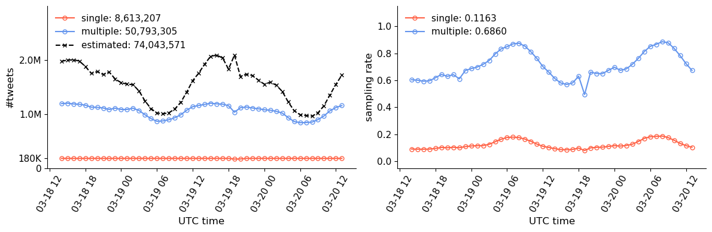

# Code and Data for Twitter Sampling Effects Study

We release the code and data for the following paper.
If you use the software, datasets, or refer to its results, please cite:
> [Siqi Wu](https://avalanchesiqi.github.io/), [Marian-Andrei Rizoiu](http://www.rizoiu.eu/), and [Lexing Xie](http://users.cecs.anu.edu.au/~xlx/). Variation across Scales: Measurement Fidelity under Twitter Data Sampling. *AAAI International Conference on Weblogs and Social Media (ICWSM)*, 2020. \[[paper](https://avalanchesiqi.github.io/files/icwsm2020sampling.pdf)\]

## Crawling software package: [Twitter-intact-stream](https://github.com/avalanchesiqi/twitter-intact-stream)
Twitter-intact-stream is a tool for collecting (nearly) complete Twitter filter stream, and first used to construct datasets in this paper.

### Have you thought about collecting tweets related to the global pandemic COVID19?
The posts over the Twittersphere are really boosted during the global lockdown.
Typically, the public/free Twitter filtered streaming API allows for up to 4.32M per day, this is way below the volume of COVID19 related tweets.

Checkout our collecting tool Twitter-intact-stream!
We provide a pre-configured script to collect relevant tweets of COVID19.
It can retrieve 25M tweets per day with an estimated 70% sampling rate.
The following image plots temporal tweet counts and sampling rates for a dataset collected from 2020-03-18 to 2020-03-20.

## Data
We release 2 pairs of complete/sampled retweet cascades on topic Cyberbullying (sampling rate: 0.5272) and YouTube (sampling rate: 0.9153).
The data is hosted on [Dataverse]().
Cyberbullying | complete | Sample
------------ | -------------
#cascades | 3,008,572 | 1,168,896
avg. retweets per cascade | 15.63 | 10.97
#cascades (≥50 retweets) | 99,952 | 29,577

## Code usage
We provide a quickstart bash script:
[run_all_wrangling.sh](/wrangling/run_all_wrangling.sh)

This script can generate all the data files to run the experiments under the [data](/data), [entities](/entities), and [cascades](/cascades).

For network analysis, another quickstart bash script is provided for generating all the data files:
[run_network_analysis.sh](/networks/run_network_analysis.sh)
